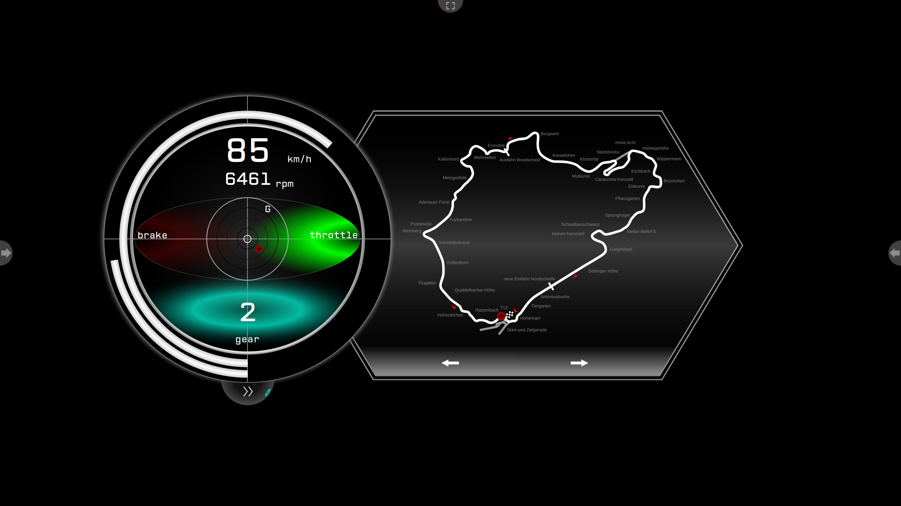
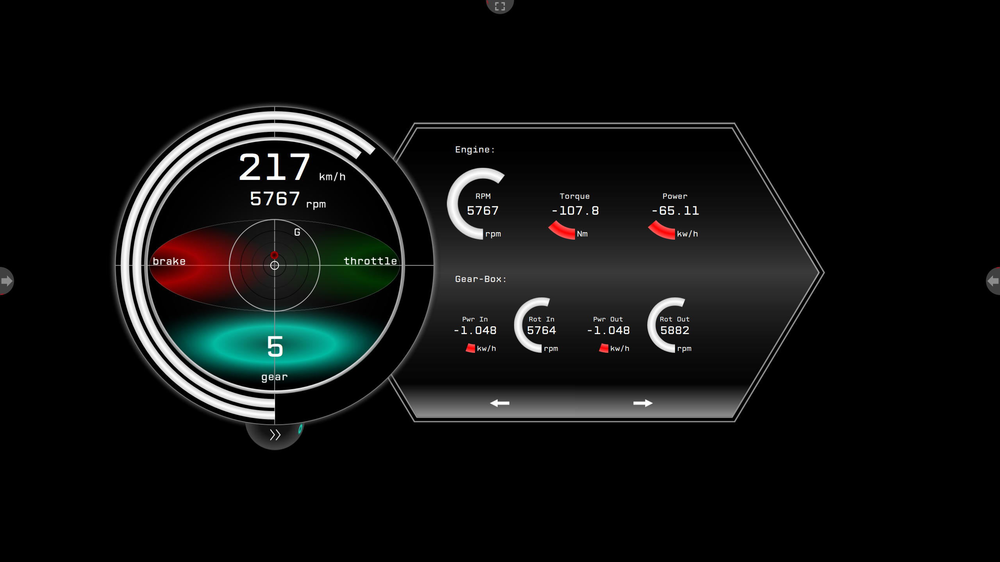

# OpenDashboardFrontend-ArcRaceDashboard

## Description

Round dashboard without needles but arcs instead. The basic idea is to have a round dashboard that could be placed on a small OLED screen of racing cars stering wheel to be rotated against the rotation of the steering wheel.

## Usage

	# Clone repo
	git  clone git@github.com:OpenDashboardUI/OpenDashboardFrontend-ArcRaceDashboard.git
	git submodule init
	git submodule update

	# Building (creating temporary graphic files)
	mkdir build/
	cd build/
	cmake ../
	make

	# Running
	cd ../
	open_dashboard_backend -c external/OpenDashboardTrackData/nurburgring_nordschleife.xml ./ArcRaceDashboard.qml

## Video

## Preview

 

 